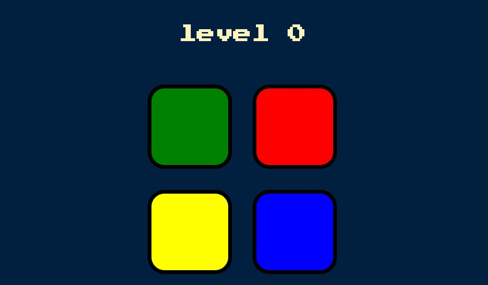

# Simon Game

Welcome to the Simon Game! This is a fun memory game where the player must repeat a sequence of colors and sounds. Each round, a new color is added to the sequence, increasing the challenge.


## *📸 Screenshots*:


## Features
- Interactive gameplay with increasing difficulty
- Color and sound feedback for user interactions
- Level tracking

## Technologies Used

- HTML5
- CSS3
- jQuery

## Setup and Installation

To get a local copy up and running, follow these simple steps:

1. *Clone the repository:*

   ```bash
   git clone https://github.com/your-username/simon-game.git
   ```
   
2. *Navigate to the project directory:*
   ```bash
   cd simon-game
   ```
   
3. *Open index.html in your browser:*
   *Simply double-click the index.html file or open it with your preferred browser.*


## Gameplay Instructions

1. Start the game:
   *Press any key to start the game.*

2. Repeat the sequence:
   *Watch the sequence of colors and sounds. Repeat the sequence by clicking the colored buttons in the correct order.*

3. New round:
   *Each round, a new color is added to the sequence. The game continues until you make a mistake.*

4. Game over:
   *If you press the wrong button, the game ends. Press any key to restart.*


*Thanks for playing Simon game!*
